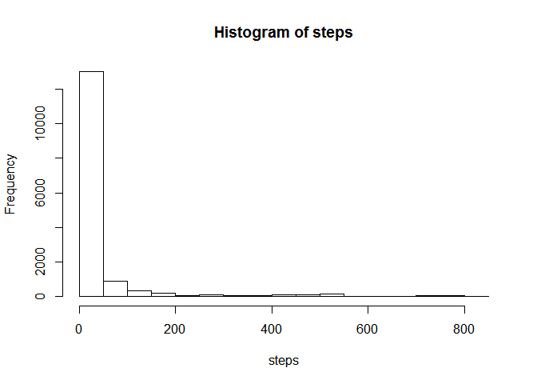
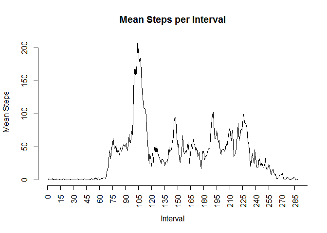

# Reproducible Research: Peer Assessment 1
## Introduction
The purpose of this assignment is to analyse data from a personal activity monitoring device.  
Data taken from an individual every five minutes during the months of October and November of 2012 is recorded in a file named "activity.csv".  
The data is available at this URL : [dataset](https://d396qusza40orc.cloudfront.net/repdata%2Fdata%2Factivity.zip)  
The dataset consist of three variables:  
-steps: Number of steps taking in a 5-minute interval (missing values are coded as NA)  
-date: The date on which the measurement was taken in YYYY-MM-DD format  
-interval: Identifier for the 5-minute interval in which measurement was taken

## Loading and preprocessing the data
The preprocessing of the data is very simple:  
-First the variable "interval"" is transformed to a factor. This gives a variable with 288 levels.  


```r
# Load necesary packages
library(downloader)

# Download and unzip
if(!file.exists("data_project")){
    dir.create("data_project")
}
URL <- "https://d396qusza40orc.cloudfront.net/repdata%2Fdata%2Factivity.zip"
PATH <- "./data_project/"
FILE <- "repdata_data_activity.zip"
download(URL, paste(PATH,FILE,sep=""))
unzip(paste(PATH,FILE,sep=""))

#Load data
activity<-read.csv("activity.csv", header = TRUE, stringsAsFactors = FALSE)
str(activity)
```

```
## 'data.frame':	17568 obs. of  3 variables:
##  $ steps   : int  NA NA NA NA NA NA NA NA NA NA ...
##  $ date    : chr  "2012-10-01" "2012-10-01" "2012-10-01" "2012-10-01" ...
##  $ interval: int  0 5 10 15 20 25 30 35 40 45 ...
```

```r
activity$interval<-as.factor(activity$interval)
str(activity)
```

```
## 'data.frame':	17568 obs. of  3 variables:
##  $ steps   : int  NA NA NA NA NA NA NA NA NA NA ...
##  $ date    : chr  "2012-10-01" "2012-10-01" "2012-10-01" "2012-10-01" ...
##  $ interval: Factor w/ 288 levels "0","5","10","15",..: 1 2 3 4 5 6 7 8 9 10 ...
```


## What is mean total number of steps taken per day?

The following code will draw a histogram, and calculate the mean total number of steps and the median of the total number of steps.


```r
# Make a histogram of the total number of steps taken each day
with(activity, hist(steps))
```

 

```r
# Calculate mean total number of steps per day
medias<-with(activity, 
    {tapply(steps, date, mean)
    })
media<-mean(medias, na.rm=TRUE)
media
```

```
## [1] 37.38
```

```r
# Calculate the median of the total number of steps per day
medianas<-with(activity, 
     {tapply(steps, date, median)
                      })
mediana<-mean(medianas, na.rm=TRUE)
mediana
```

```
## [1] 0
```

The mean total number of steps is 37.3826 and the median is 0 which is evident in the histogram.

## What is the average daily activity pattern?
There are (60/5)*24=288 five minutes intervals per day. In order to calculate the average number of steps per interval the variable "interval" was transformed to a factor. Then the mean of steps per interval was computed. This new data set is called StepsPerInterval. Finaly a time series of the mean steps per interval is ploted.


```r
StepsPerInterval<-with(activity, 
{tapply(steps, interval, mean, na.rm = TRUE)
})

marcas<-seq(from =0, to=300, by=15)
plot(StepsPerInterval, type = "l", main ="Mean Steps per Interval", xlab="Interval", ylab="Mean Steps", axes = FALSE)
axis(side=1, at=marcas, las = 2)
axis(2)
```

 

```r
MaxSteps<-max(StepsPerInterval)
IntervalMaxSteps<-which(StepsPerInterval == MaxSteps, arr.ind=TRUE)
IntervalMaxSteps<-as.data.frame(IntervalMaxSteps)
```

In the previous time series plot we can observe that during the first 65 to 70 five minute intervals which corresponds aproximately to the first 6 hours of the day there are almost no steps. The average maximum number of steps is 206.1698 and occurs in the interval 104.

## Imputing missing values


## Are there differences in activity patterns between weekdays and weekends?
