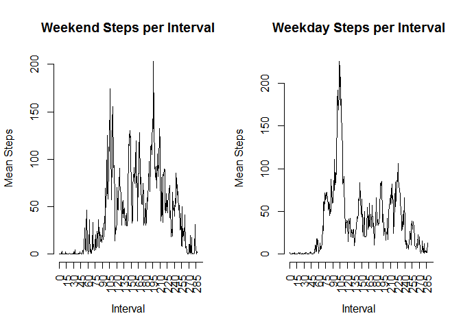

# Assignment 1
Monica Figueroa  
14 de junio de 2015  

## Introduction
The purpose of this assignment is to analyse data from a personal activity monitoring device.  
Data taken of an individual every five minutes during the months of October and November, 2012 is recorded in a file named "activity.csv".  
The data is available at this URL : [dataset](https://d396qusza40orc.cloudfront.net/repdata%2Fdata%2Factivity.zip)

The dataset consist of three variables:  
-steps: Number of steps taking in a 5-minute interval (missing values are coded as NA)  
-date: The date on which the measurement was taken in YYYY-MM-DD format  
-interval: Identifier for the 5-minute interval in which measurement was taken  
  
## Data Analysis  
###Loading and preprocessing the data  


```r
# Load necesary packages
library(downloader)

# Download and unzip
if(!file.exists("data_project")){
    dir.create("data_project")
}

if(!file.exists("figures")){
    dir.create("figures")
}
URL <- "https://d396qusza40orc.cloudfront.net/repdata%2Fdata%2Factivity.zip"
PATH <- "./data_project/"
FILE <- "repdata_data_activity.zip"
download(URL, paste(PATH,FILE,sep=""))
unzip(paste(PATH,FILE,sep=""))

# Load data
activity<-read.csv("activity.csv", header = TRUE, stringsAsFactors = FALSE)
str(activity)

# Subset data aliminating all the incomplete observations
activity2<-activity[!is.na(activity$steps),]

# Convert variable date from string to data
activity2$date<-as.Date(activity2$date)
```
 
###What is the mean total number of steps taken per day? 


The following code will make a histogram, and calculate the mean total number of steps and the median of the total number of steps.


```r
# Divide the data in the different days
activity3 <- split(activity2$steps, activity2$date)

# Sum the number of steps per day
tot_num_steps_day<-as.data.frame(sapply(activity3, sum))

# Create histogram of the total number of steps per day
noms<-c("Steps")
names(tot_num_steps_day)<-noms

library(ggplot2)
ggplot(tot_num_steps_day, aes(x=Steps)) + geom_histogram(binwidth=1000)
```

 

```r
summary(tot_num_steps_day$Steps)
```

```
##    Min. 1st Qu.  Median    Mean 3rd Qu.    Max. 
##      41    8841   10760   10770   13290   21190
```

```r
AveTotNumStepsDay<-mean(tot_num_steps_day$Steps)
AveTotNumStepsDay
```

```
## [1] 10766.19
```

```r
MedTotNumStepsDay<-quantile(tot_num_steps_day$Steps, 0.5)
MedTotNumStepsDay
```

```
##   50% 
## 10765
```


The mean number if steps is 1.0766189\times 10^{4} , and the median is 1.0765\times 10^{4}.  
  
## What is the average daily activity pattern?
There are (60/5)*24=288 five minutes intervals per day. In order to calculate the average number of steps per interval the variable "interval" was transformed to a factor. Then the mean of steps per interval was computed. This new data set is called StepsPerInterval. Finaly a time series of the mean steps per interval is ploted.


```r
StepsPerInterval<-with(activity, 
{tapply(steps, interval, mean, na.rm = TRUE)
})
length(StepsPerInterval)
```

```
## [1] 288
```

```r
marcas<-seq(from =0, to=300, by=15)
plot(StepsPerInterval, type = "l", main ="Mean Steps per Interval", xlab="Interval", ylab="Mean Steps", axes = FALSE)
axis(side=1, at=marcas, las = 2)
axis(2)
```

 

```r
MaxSteps<-max(StepsPerInterval)
IntervalMaxSteps<-which(StepsPerInterval == MaxSteps, arr.ind=TRUE)
IntervalMaxSteps<-as.data.frame(IntervalMaxSteps)
```

In the previous time series plot we can observe that during the first 65 to 70 five minute intervals which corresponds aproximately to the first 6 hours of the day there are almost no steps. The average maximum number of steps is 206.1698113 and occurs in the interval 104, around the 8.6 hour of the day.  

## Impute Missing Values.  

### 1.	Calculate and report the total number of missing values in the dataset.  


```r
# Calculate the number of missing values
binaria<-is.na(activity$steps)
ActivityMissVal<-activity$steps[binaria]
NoMissVals<-length(ActivityMissVal)
```

The number of missing values is 2304.  

### 2.  Impute missing values.
To compute missing values I am going to use the library mice which imputes data via chained equations.


```r
# load library mice
library(mice)
```

```
## Loading required package: Rcpp
## Loading required package: lattice
## mice 2.22 2014-06-10
```

```r
steps2<-mice(activity, m = 3, maxit = 3)
```

```
## 
##  iter imp variable
##   1   1  steps
##   1   2  steps
##   1   3  steps
##   2   1  steps
##   2   2  steps
##   2   3  steps
##   3   1  steps
##   3   2  steps
##   3   3  steps
```

### 3.  Create a new data set with the imputed data. 


```r
activity4<-complete(steps2)
```
  

```r
# Divide the data in the different days
activity5 <- split(activity4$steps, activity2$date)
```

```
## Warning in split.default(activity4$steps, activity2$date): data length is
## not a multiple of split variable
```

```r
# Sum the number of steps per day
tot_num_steps_day2<-as.data.frame(sapply(activity5, sum))

# Create histogram of the total number of steps per day

names(tot_num_steps_day2)<-noms
ggplot(tot_num_steps_day2, aes(x=Steps)) + geom_histogram(binwidth=1000)
```

 

```r
summary(tot_num_steps_day2$Steps)
```

```
##    Min. 1st Qu.  Median    Mean 3rd Qu.    Max. 
##      41    9819   11830   12930   15100   36020
```

```r
AveTotNumStepsDay2<-mean(tot_num_steps_day2$Steps)
AveTotNumStepsDay2
```

```
## [1] 12926.74
```

```r
MedTotNumStepsDay2<-quantile(tot_num_steps_day2$Steps, 0.5)
MedTotNumStepsDay2
```

```
##   50% 
## 11829
```

With this new data set the mean total number of steps is 1.2926736\times 10^{4} and the median is 1.1829\times 10^{4}. The difference among the imputed and original data is  significant. The histogram shows a sqewd distribition in comparison with the one obtained with the reduced data. 

## Are there differences in activity patterns between weekdays and weekends?  


```r
# Creat a factor tha indicates the day of the week
activity4$date<-as.Date(activity4$date)
activity4$dayweek<-weekdays(activity4$date)
str(activity4)
```

```
## 'data.frame':	17568 obs. of  4 variables:
##  $ steps   : int  0 0 0 0 0 0 0 0 0 0 ...
##  $ date    : Date, format: "2012-10-01" "2012-10-01" ...
##  $ interval: int  0 5 10 15 20 25 30 35 40 45 ...
##  $ dayweek : chr  "lunes" "lunes" "lunes" "lunes" ...
```

```r
# Creat a factor that indicates weekday or weekend

for (i in 1:nrow(activity4)) {
    if (activity4[i, 4] == "domingo" | activity4[i, 4] == "sábado") {
        activity4[i, 4] <- "Weekend"
    } else {
        activity4[i, 4] <- "Weekday"
    }
}

# Split data in weekdays and weekends
activity6 <- split(activity4, activity4$dayweek)
A6weekends <- activity6[["Weekend"]]
A6weekdays <- activity6[["Weekday"]]

WEStepsPerInterval<-with(A6weekends, 
                       {tapply(steps, interval, mean, na.rm = TRUE)
                       })


WDStepsPerInterval<-with(A6weekdays, 
                         {tapply(steps, interval, mean, na.rm = TRUE)
                         })
par(mfrow=c(1,2))
plot(WEStepsPerInterval, type = "l", main ="Weekend Steps per Interval", xlab="Interval", ylab="Mean Steps", axes = FALSE)
axis(side=1, at=marcas, las = 2)
axis(2)
plot(WDStepsPerInterval, type = "l", main ="Weekday Steps per Interval", xlab="Interval", ylab="Mean Steps", axes = FALSE)
axis(side=1, at=marcas, las = 2)
axis(2)
```

 

